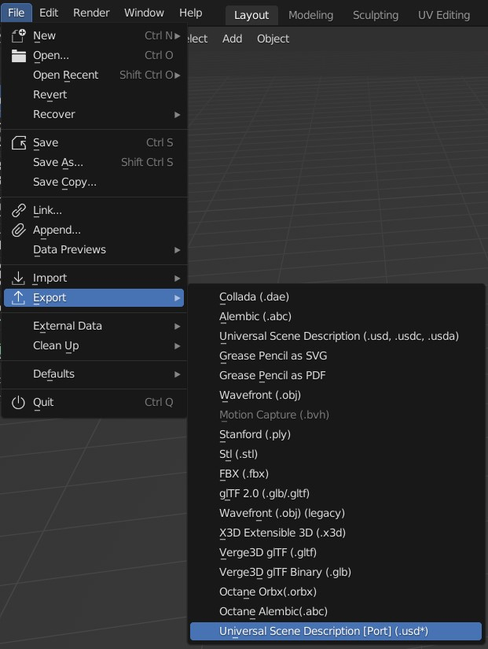
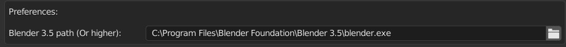
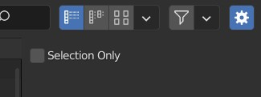

# Blender USDZ Export Add-on

This add-on allows users to export their Blender projects to the USDZ format, even if they are using versions of Blender below 3.5, which added native support for USDZ export. The add-on achieves this functionality by running an instance of Blender 3.5 or a higher version in the background.

## Installation

Just install the add-on like any other Blender add-on. You can download the latest release from the [Releases](https://github.com/RodrigoGama1902/blender-addon-usd-exporter-port/releases)

## Add-on Preferences Setup

In order to use the add-on, you must specify the path to the Blender executable that you want to use for the export process.

## Exporting to USDZ

Locate the `Universal Scene Description [Port]` operator in the `File > Export` menu. The operator will open a file browser where you can specify the path to the output file. The operator will then run an instance of Blender 3.5 or a higher version in the background to perform the export process.

## Operator Options

For now, the only option available is the `Selection Only` option, which allows you to export only the selected objects in the scene. But more options will be added in the future.

Note: The add-on supports using a Blender version higher than 3.5 if you have a version with an improved USDZ exporter. Specify the file path to the desired Blender executable in the add-on preferences to utilize a specific version.

Please make sure to regularly check for updates to the Blender USDZ Export add-on to stay up to date with any new features or bug fixes.